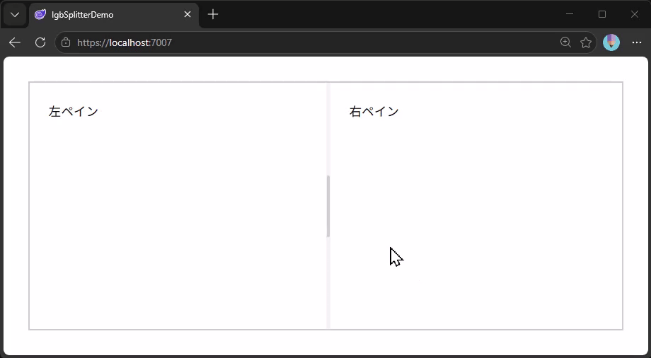

# Ignite UI for Blazor にスプリッターコンポーネントが新登場!

## 概要

このリポジトリは、インフラジスティックス・ジャパン株式会社 Blog の下記記事で紹介しているサンプルアプリケーションのソースコード一式です。

[Ignite UI for Blazor にスプリッターコンポーネントが新登場!](about://blank)

## ライブデモ

下記リンク先で、実際に動く様子を確認頂けます。

https://igjp-sample.github.io/IgbSplitterDemo/

GitHub アカウントをお持ちであれば、以下のリンク先の GitHub Codespace にて、お手元の PC 環境を準備することなく、ブラウザ内ですぐに、いろいろ実装を変えながら試すことも可能です。

## ライセンス

[The Unlicense](LICENSE)